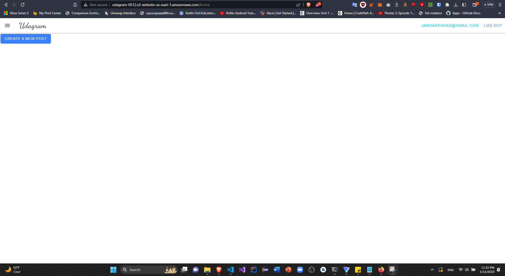

# Hosting a Full-Stack Application

## Overview
This is a GitHub repo that deploys a sample Angular application to an Amazon AWS server using S3 bucket to hold the assets for the frontend, Elastic Beanstalk to host the backend API and a Postgre Server hosted over Amazon RDS. In addition, CI/CD pipelines were used to help automate changes to the code as well as making sure code changes deployed successfully. 

Here is a link to the live appliication: http://udagram-0512.s3-website-us-east-1.amazonaws.com/